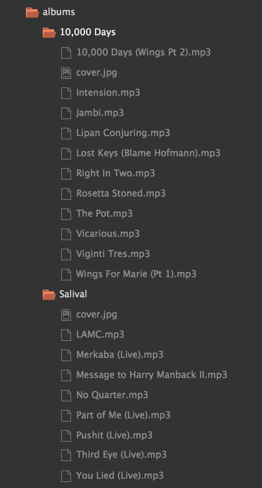

# Jukebox

Just a fun project to play around with Express, Mustache, and HTML5.

To run project:
* cd to the project root
* put some albums in the albums directory
* the albums should contain .mp3 format songs
* add a cover.jpg to every album folder
* npm install
* node app.js (use nodemon for auto restart server on code change [js files ony])
* visit localhost:3000

